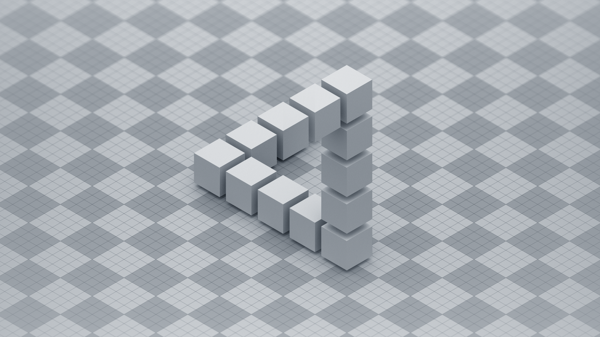

# "Penrose Pathtraced" by yx

This is a procedural artwork released at Revision 2019, placing 7th in the 4KB Executable Graphics competition.

This source code release is for archival reasons - as such, aside from removal of compiled and intermediate binaries, this is an unedited snapshot of the source from when the released artwork was built.

This uses [Shader_Minifier](https://github.com/laurentlb/Shader_Minifier) for shader minification and [Crinkler](https://github.com/runestubbe/Crinkler) for executable compression. Binaries are included in the archive as the exact versions that were used for the release.

Download & comments: https://www.pouet.net/prod.php?which=81059

Some post-mortem thoughts:

* The seam of the trick, while hidden, is unintentionally revealed by the difference in AO intensity between the cubes. In retrospect, I've worked out how this could have been avoided.

* The vignette effect is broken - an inverse (lighter corners) vignette is applied in the post-processing pass, but I'd forgotten that I already had a regular vignette effect in the accumulation pass. The two essentially cancel each other out.

* Both the floor and the cubes went through several revisions, including reflective patches on the floor and complex greebling of the cubes. Ultimately I decided the simple grid-lined checkerboard and pure cubes would be most Escher-esque.

* noby's [Leviathan](https://github.com/armak/Leviathan-2.0) framework served as an invaluable resource while building the framework for this entry in a frenzy at the party.
